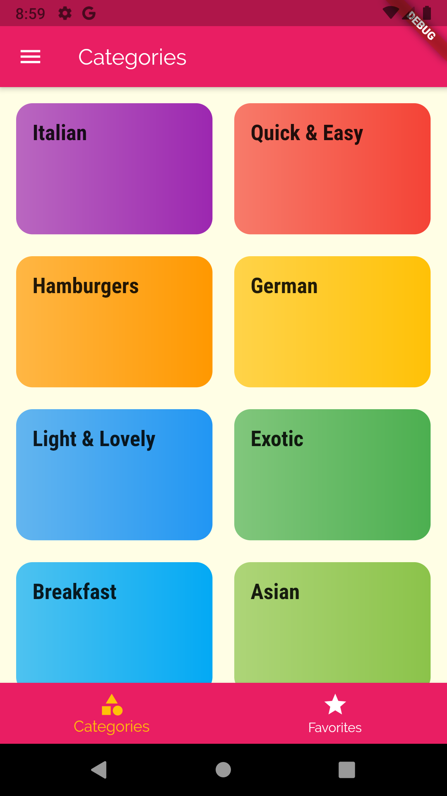
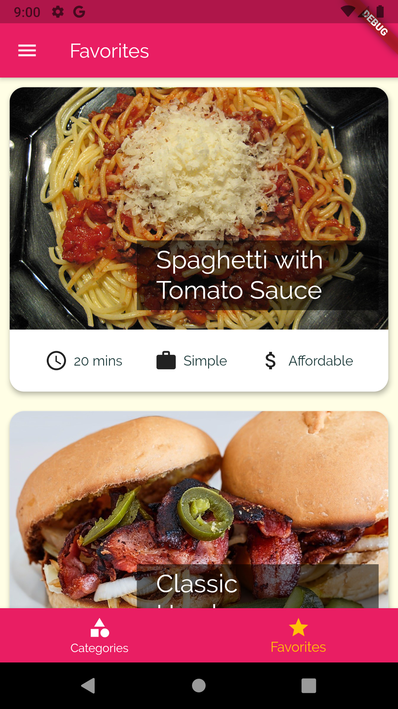
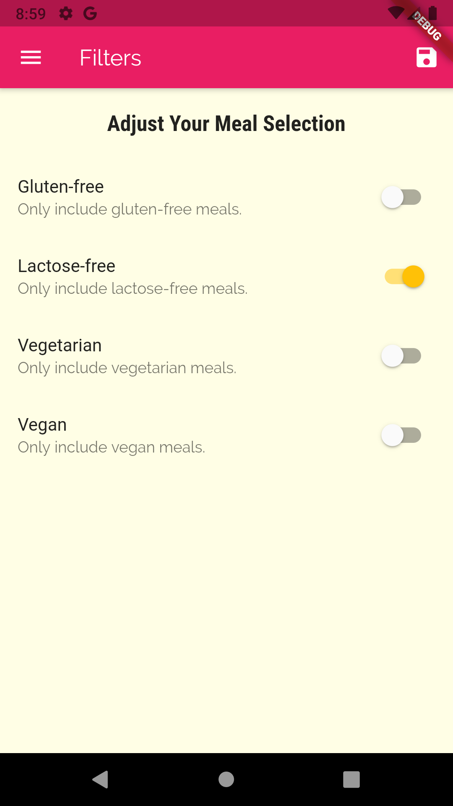
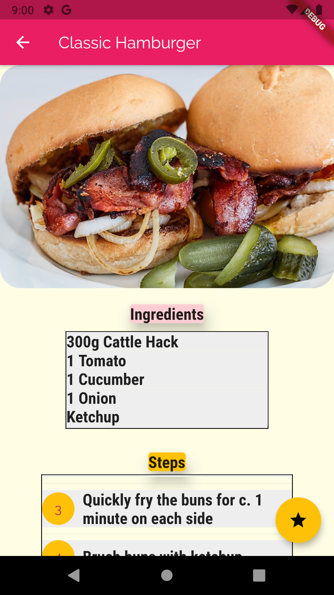
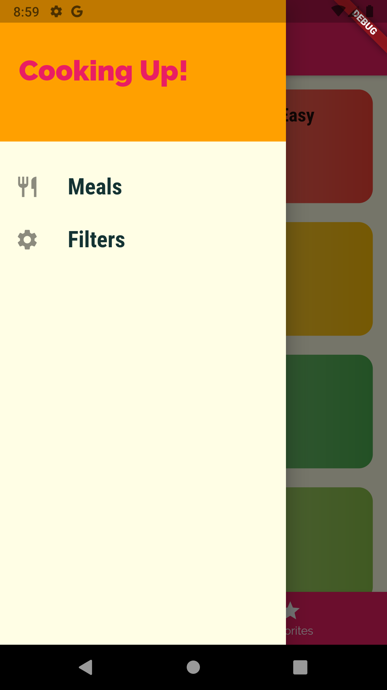

A mobile application built using Flutter/Dart.
It shows a list of kitchens and in each a list of meals where users can make some recipes favorites, it also gives the user the ability to filter the meals available. 

# APP Demo
 

 

 

 

 

